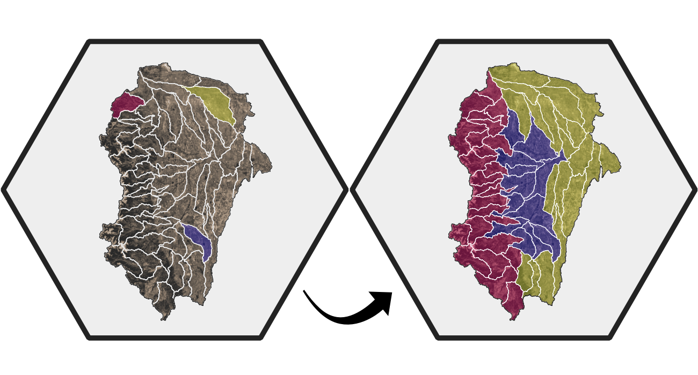

# Formulation and Parameter Regionalization for the NextGen Framework
[](.github/workflows/ci.yml)
[](https://opensource.org/license/bsd-2-clause)
[](https://github.com/NGWPC/nwm-region-mgr)





`nwm_region_mgr` is a Python package for identifying optimal model formulations and parameter values in ungauged catchments. It leverages calibration data from gauged catchments and catchment attributes to improve hydrologic modeling and forecasting skill across regions, playing a key role in the NextGen and NWM ecosystem.


## Key Features

- **Formulation Regionalization** – Ranks NextGen model formulations for ungauged catchments based on performance at gauged sites in a region.
- **Parameter Regionalization** – Estimates parameter values by intelligently transferring calibrations across catchments based on similarity.
- **Clustering Methods** – Groups catchments with shared hydrologic characteristics using multiple clustering approaches.
- **Distance methods** – Identify donors using distance metrics that characterize catchment similarity/dissimilarity.
- **Diagnostic Plots** – Generates diagnostic plots and maps that explain formulation and parameter choices.
- **Scalable Workflows** – Efficiently supports studies from individual watersheds to CONUS-wide applications.
- **Customizable Configurations** – Full control of workflows via human-readable config files.

## Docker Run Time Environment (RTE)
### Step 0. Build Docker images and download data
Follow NMW-RTE [README](https://github.com/NGWPC/nwm-rte/blob/development/README.md) to build Docker images and download sample data.

> **Note:** A single ngen RTE Docker image needs to be built before continuing to the regionalization steps below. 
> Make sure that RTE's build script runs successfully.  RTE's default run script (for forecasting) is not used by the regionalization workflow and should be skipped.

### Step 1. Run regionalization

First, navigate to nwm-rte directory, e.g.,
```bash
cd ~/ngwpc/nwm-rte
```

#### a) Run formulation regionalization alone (no parreg):
The short flag `-f` can also be used in place of `--formreg`. Prior to running, configure the settings in `configs/config_general.yaml` and `configs/config_formreg.yaml`.
```bash
time ./ngen_rte_run_region.sh --formreg
```
Typically this step can be skipped since parameter regionalization also runs formulation regionalization as a prerequisite.

#### b) Run parameter regionalization (formreg is also ran as a prerequisite):
The short flag `-p` can also be used in place of `--parreg`. Prior to running, configure the settings in `configs/config_general.yaml`, `configs/config_formreg.yaml` and `configs/config_parreg.yaml`.
```bash
time ./ngen_rte_run_region.sh --parreg
```
### Step 2. Run NGEN
Run a NGEN simulation:

The short flag `-n` can also be used in place of `--ngen`. Prior to running, configure the settings in `configs/config_ngen.yaml`.
```bash
time ./ngen_rte_run_region.sh --ngen
```
### Step 3. Run Evaluation
Run an evaluation:

The short flag `-e` can also be used in place of `--eval`. Prior to running, configure the settings in `configs/config_eval.yaml`.
```bash
time ./ngen_rte_run_region.sh --eval
```

### To run all steps in one command
```bash
time ./ngen_rte_run_region.sh --parreg --ngen --eval
```

## Desktop/Workspace
### Clone & Build

#### 1. clone ngen-region-mgr from Github

```bash
git clone https://github.com/NGWPC/nwm-region-mgr.git
cd nwm-region-mgr
```

#### 2. create python venv
Create a virtual environment to isolate the dependencies of this library from your base Python environment.
```bash
python3.11 -m venv .venv
source .venv/bin/activate
pip install --upgrade pip
```

#### 3. install nwm-region-mgr

You will then be able to install nwm_region_mgr. There are a few variants that users may be interested in.

```bash
# Regular package install
pip install .
# Install the package in edit mode (for development)
pip install -e .
# Install additional dependencies for parameter regionalization
pip install .[parreg]
# Install dependencies for docs and dev
pip install .[docs,dev]
```

### STEP 1: Run regionalization to produce regionalized parameters and formulations

#### 1) Set up configuration yaml files

Three yaml config files are needed to run regionalization
- **config_general.yaml**: general settings for the overall regionalization process.
- **onfig_formreg.yaml**: specific settings for the formulation regionalization process.
- **config_parreg.yaml**: specific settings for the parameter regionalization process.

Follow the sample config files (nwm_region_mgr/configs) to set up the configurations
for your regionalization application as needed.

Sample input data can be downloaded from **s3://ngwpc-dev/regionalization/inputs**

#### 2) Run the regionalization script

```bash
python [NGEN_REG_ROOT]/nwm-region-mgr/regionalization.py [COFIG_DIR] [REG_TYPE]
```
Where:
- [NGEN_REG_ROOT] refers to the directory where nwm-region-mgr is installed
- [COFIG_DIR] refers to the directory containing the three config files as noted in 1), e.g.,
- [REG_TYPE] refers to the type of regionalization to run, either 'formreg' (formulation regionalization only) or 'region' (parameter regionalization, which also runs formulation regionalization first if not done already). If not specified, the default is 'region'.

```bash
python regionalization.py configs formreg # to run formulation regionalization only
python regionalization.py configs region # to run parameter regionalization (and formulation regionalization if not done already)
```

### STEP 2: Run NGEN simulation with regionalized parameters

To void complications from building ngen and its submodules locally, we recommend you always run NGEN simulation 
with regionalized parameters and formulations from a Docker container. Follow instructions from the **Docker Run Time Environment (RTE)** section above. 

### STEP 3: Evaluate NGEN simulation with nwm.verf

#### 1) Donwload and install [nwm.verf](https://github.com/NGWPC/nwm-verf)
It is recommentded you install nwm.verf in its own venv. Note [nwm.eval](https://github.com/NGWPC/nwm-eval-mgr) needs to installed as a dependency

#### 2) Set up configurations for evaluation
Follow example config at [config_eval.yaml](https://github.com/NGWPC/nwm-region-mgr/blob/development/sample_files/configs/config_eval.yaml)

Check out what metrics are currently supported [here](https://confluence.nextgenwaterprediction.com/display/NGWPC/Forecast+Verification+%28ngen-verf%29%3A+Configuration)

Sample input data can be downloaded from **s3://ngwpc-dev/regionalization/data/inputs/eval** 

#### 3) Activate venv for nwm.verf
```bash
source ~/repos/nwm-verf/venv/bin/activate
```
#### 4) Run evaluation
```bash
python -m nwm.verf config_eval.yaml
```
#### 5) Check outputs
Outputs from evaluation can be found in *[output_dir]* as specified in **config_eval.yaml**


### Test regionalization for other VPUs or different formulations

- Create pseudo forcing data by recycling existing forcing files, using this [script](https://github.com/NGWPC/nwm-region-mgr/blob/yliu_NGPWC-6984/util_scripts/run_create_pseudo_forcing_csv.sh)
- Create new pseduo calibration/validation stats for different formulations, using this [script](https://github.com/NGWPC/nwm-region-mgr/blob/yliu_NGPWC-6984/util_scripts/run_create_pseudo_calval_stats.sh)
- Create geopackages for a new VPU using this [script](https://github.com/NGWPC/nwm-region-mgr/blob/yliu_NGPWC-6984/util_scripts/subset_conus_gpkg_by_vpu.py)
- Create gage list files and NGEN divide-gage crosswalk file for a new domain using this [script](https://github.com/NGWPC/nwm-verf/blob/yliu_NGWPC-6986/utils/create_ngen_crosswalk_regionalization.py)
