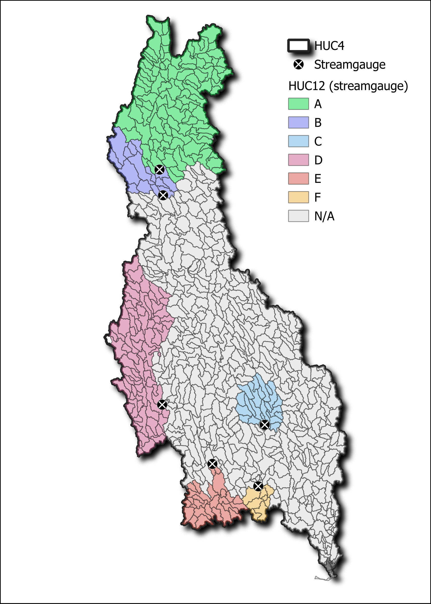
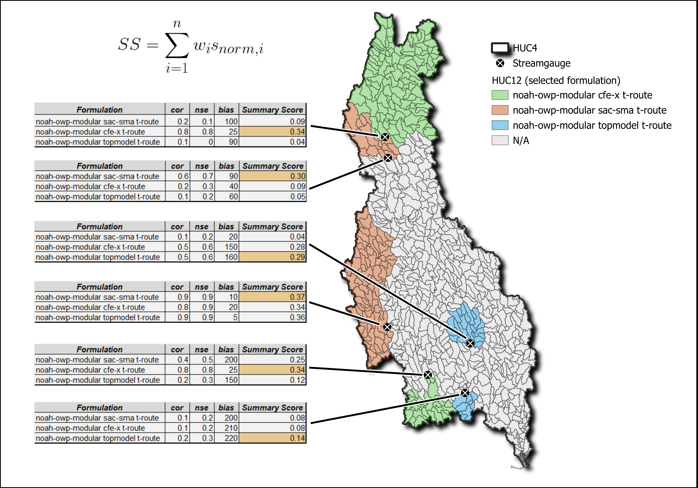
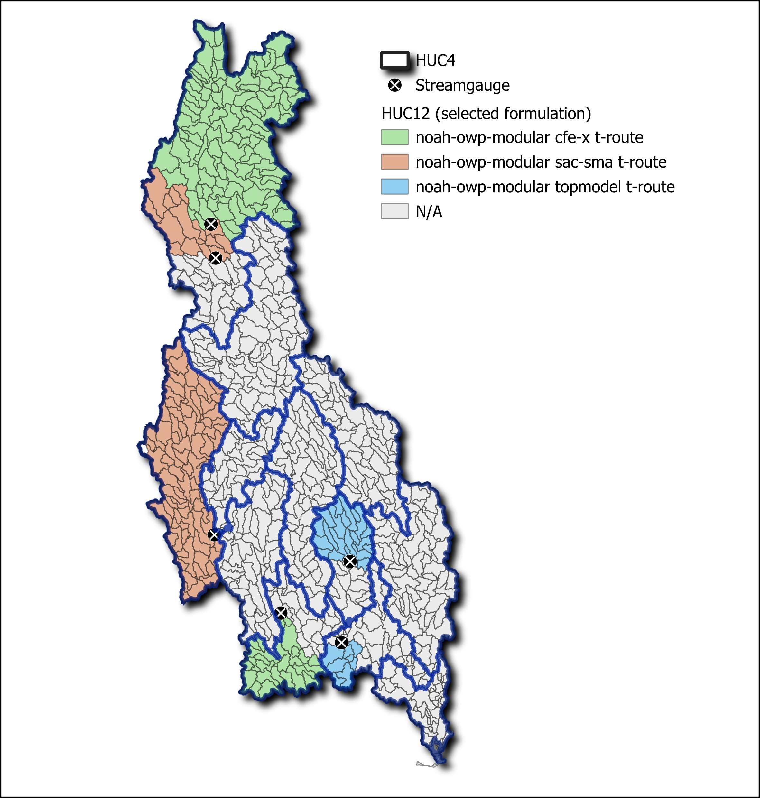
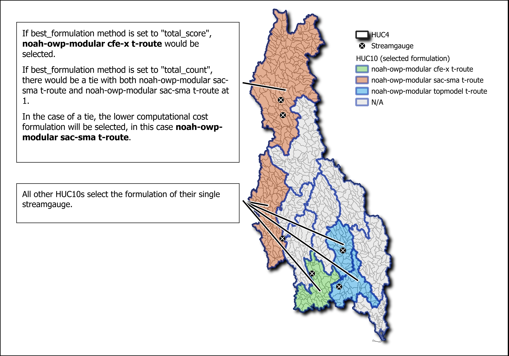
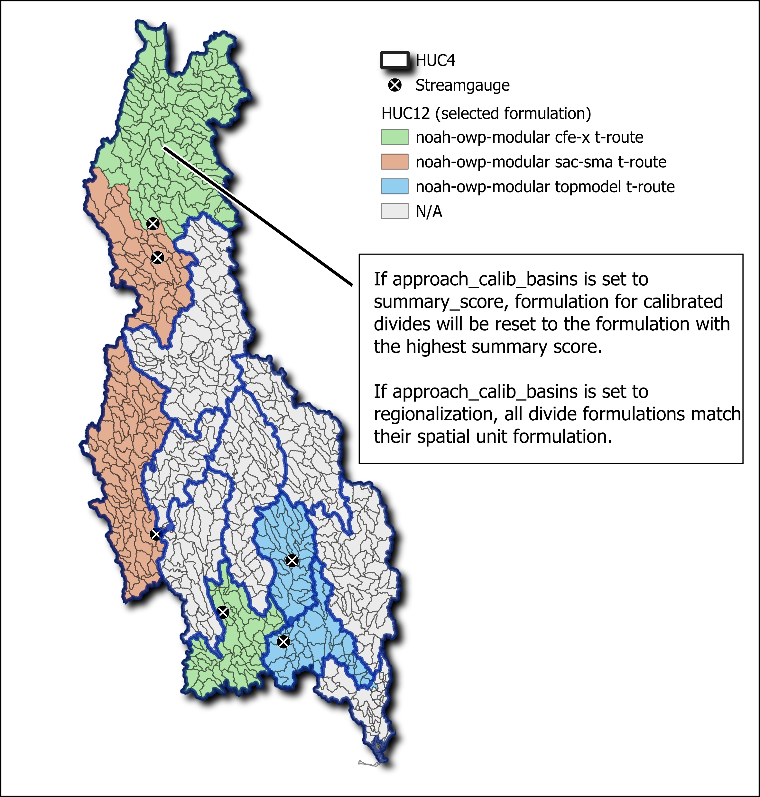

Formulation Regionalization
============================

The formulation regionalization process identifies optimal NextGen formulations for within a spatial unit (e.g., HUC10).

**Required input:** calibration and validation dataset

Process
--------

   **Figure 1.** Example formulation regionalization HUC4.

1. Calculate summary score for every gage within the VPU that has calibration stats (Figure 2).
    - metrics to use in composite summary score are specified in the config_formreg.yaml
    - Along with the metric, min and max values may be specified.  If non are specified, min and max values are derived from the data. If bounds are specified, values outside the bounds will be clipped to the bounds.
    - Direction of "better" metric values must be specified in the config_formreg.yaml
    - Metric weights must be provided in the config_formreg.yaml and sum to 1
    - The summary score for each formulation at each gage is calculated by multiplying each normalized metric by the specified weight and summing them.
2. Select best formulation at each gage (Figure 2).
    - If general.consider_cost is True in config_formreg.yaml, then only computational cost will be used to determine the best formulation per gage.
    - If general.consider_cost is False, then the formulation with the highest summary score will be selected.
3. **Optimal formulations are then assigned to all nextgen divides upstream of a given gage (Figure 2).**

   **Figure 2.** Developing summary scores and selecting the best formulation.

4. **Divides are aggregated by spatial unit specified in spatial_unit.huc_level in config_formreg.yaml (Figure 3).**

   **Figure 3.** Spatial units for aggregation.

5. An optimal formulation is then selected for the spatial unit (Figure 4).
    - If spatial_unit.best_formulation.method is "total_score", summary scores are aggregated by formulation across the spatial unit and the formulation with the highest value is selected.
    - If spatial_unit.best_formulation.method is "total_count", best formulations are counted within the spatial unit and the formulation with the highest value is selected.

   **Figure 4.** Aggregation to the spatial unit.

6. Assign formulations to calibrated basins (Figure 5).
    - If general.approach_calib_basins is summary_score, then best formulation for all calibrated divides will be reset to the formulation with the highest summary score.
    - If general.approach_calib_basins is regionalization, then the best formulation for calibrated divides is retained as the best formulation for their spatial unit.

   **Figure 5.** Optional re-designation of formulations at streamgauges.

.. toctree::
   :maxdepth: 2
