.. _output-plots:
Regionalization Output Plots
============================

Regionalization produces various plots to visualize the results from the formulation and parameter regionalization 
processes. They are saved in the output directory specified in the configuration file. Sample plots are shown below for
a VPU (VPU 03S) in the CONUS domain. The actual plots generated will depend on the configuration settings and the data used.

Formulation Regionalization Plots
---------------------------------

Summary Scores Map
~~~~~~~~~~~~~~~~~~

Description: These maps visualize the summary scores for different formulations across all calibration basins 
within the VPU. It helps in understanding the performance of each formulation spatially. The higher the summary
score, the better the formulation performance. Plot created using data from :ref:`summary_score`.

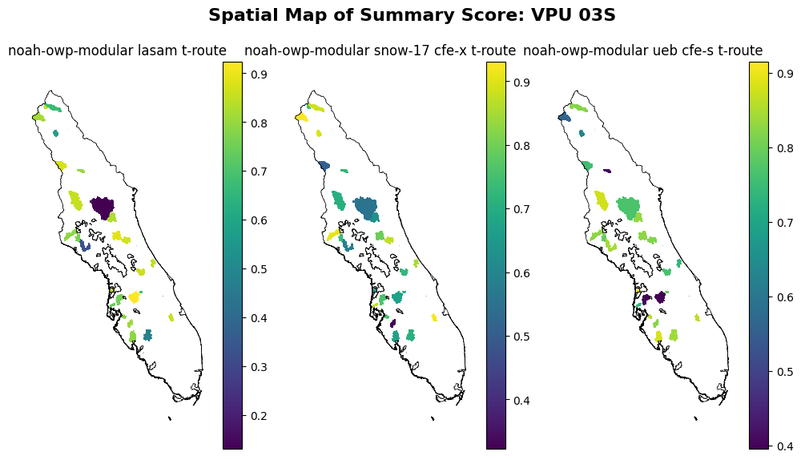

Summary Score Histogram
~~~~~~~~~~~~~~~~~~~~~~~

Description: These histograms display the distribution of summary scores for the different formulations 
across all calibration basins within the VPU. It provides insights into how many basins achieved certain 
score ranges for each formulation. The higher the summary score, the better the formulation performance.
Plot created using data from :ref:`summary_score`.

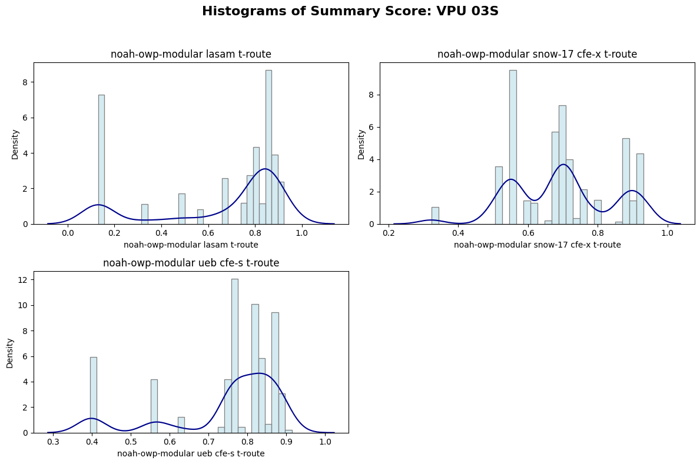

Formulation Selection Map
~~~~~~~~~~~~~~~~~~~~~~~~~

Description: This first map illustrates the selected optimal formulation for each catchment within the VPU. 
It shows how formulations are distributed spatially after the formulation regionalization process. Maps of 
total score, summary score, and formulation computational cost are also shown. 
Plot created using data from :ref:`formulations`.

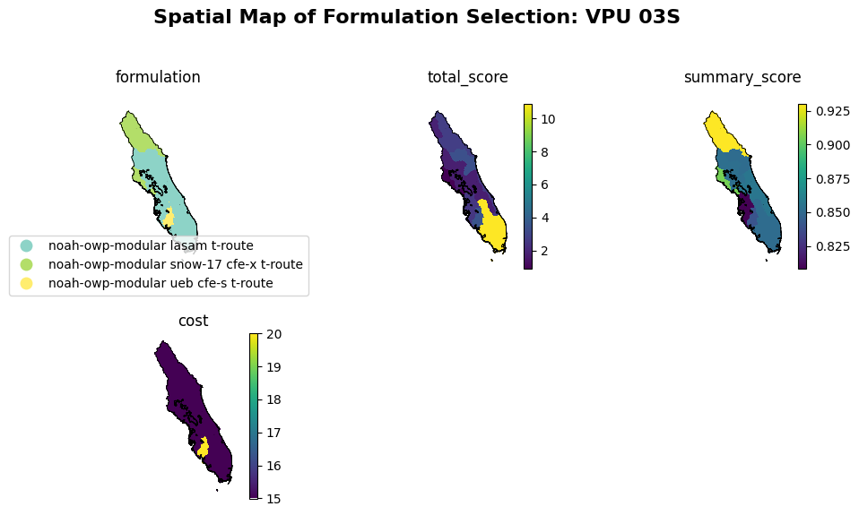

Formulation Selection Histogram
~~~~~~~~~~~~~~~~~~~~~~~

Description: These histograms display the distribution of total score, summary score, and cost given the formulation 
selection across all catchments within the VPU. It provides insights into how many catchments achieved certain 
score or cost ranges with the VPU. Plot created using data from :ref:`formulations`.

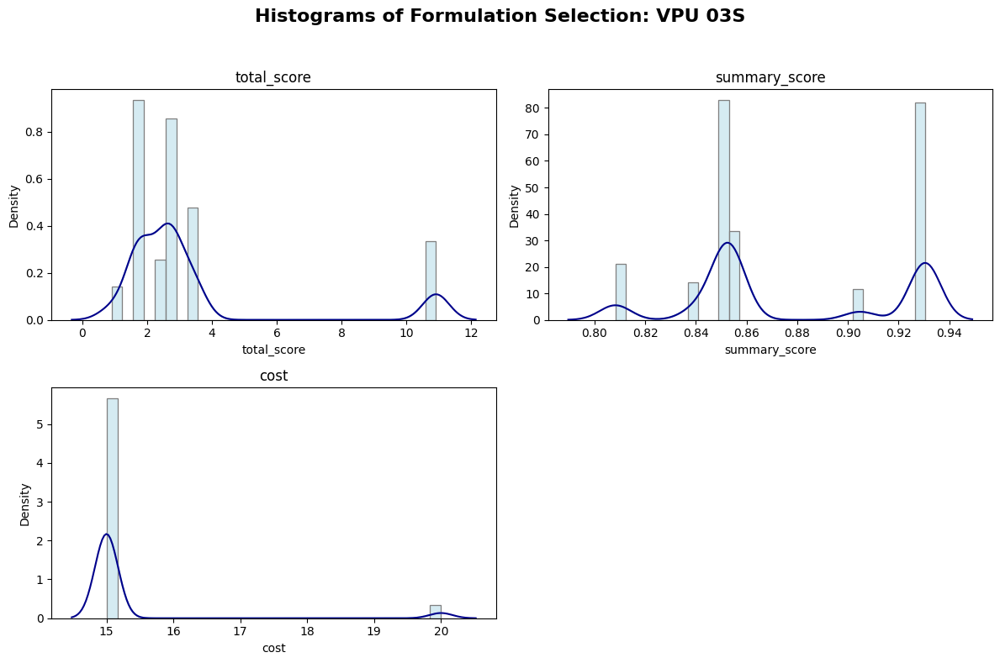

Parameter Regionalization Plots
---------------------------------

Pairs Distance Map (distance-based algorithms)
~~~~~~~~~~~~~~~~~~~~~~~~~~
Description: These maps display the spatial distribution of spatial and attribute distances (km and unitless, 
respectively) between donor and receiver catchments within the VPU. It helps in understanding how far donor 
catchments are, both geographyically and hydrologically, from their corresponding receiver catchments. 
Plot created using data from :ref:`pairs_distance_algorithms`. 
Currently supported distance-based algorithms include: gower and URF.

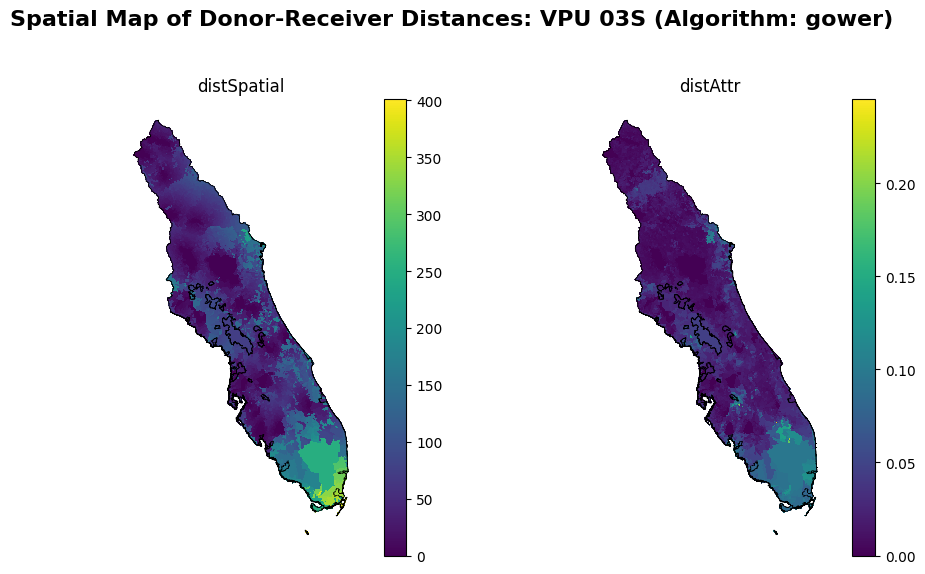

Pairs Distance Map (clustering-based algorithms)
~~~~~~~~~~~~~~~~~~~~~~~~~~
Description: These maps display the spatial distribution of spatial distances (km) between donor and receiver 
catchments within the VPU. It helps in understanding how far donor catchments are geographyically from their 
corresponding receiver catchments. Plot created using data from :ref:`pairs_cluster_algorithms`. Currently 
supported clustering algorithms include: KMeans, KMedoids, HDBSCAN, and BRICH. For clustering-based algorithms, 
only spatial distance is calculated.

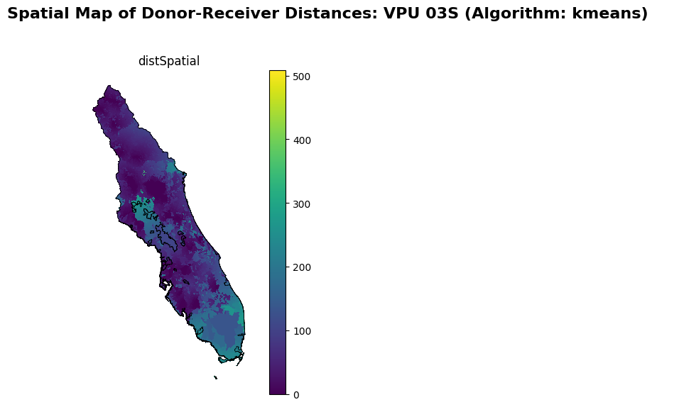

Pairs Distance Histogram (distance-based algorithms)
~~~~~~~~~~~~~~~~~~~~~~~~~~
Description: These histograms display the distribution of spatial and attribute distances (km and unitless, 
respectively) between donor and receiver catchments within the VPU. It helps in understanding how far donor 
catchments are, both geographyically and hydrologically, from their corresponding receiver catchments. 
Plot created using data from :ref:`pairs_distance_algorithms`. Currently supported distance-based algorithms 
include: gower and URF.

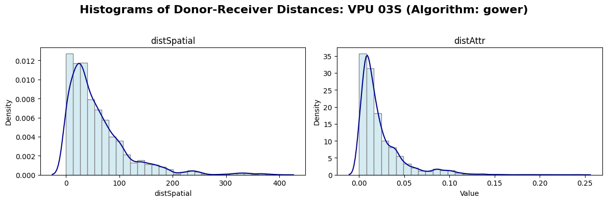

Pairs Distance Histogram (clustering-based algorithms)
~~~~~~~~~~~~~~~~~~~~~~~~~~
Description: These histograms display the distribution of spatial distances (km) between donor and receiver catchments 
within the VPU. It helps in understanding how far donor catchments are geographyically from their corresponding 
receiver catchments. Plot created using data from :ref:`pairs_cluster_algorithms`. Currently supported clustering
algorithms include: KMeans, KMedoids, HDBSCAN, and BRICH. For clustering-based algorithms, only spatial distance 
is calculated.

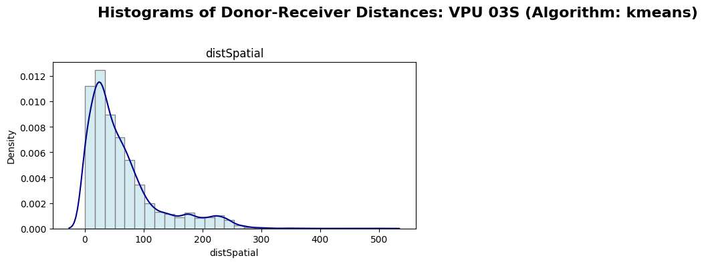

Regionalized Parameter Spatial Map
~~~~~~~~~~~~~~~~~~~~~~~~~~~~~~~~~~
Description: These maps display the spatial distribution of regionalized parameter values across all catchments 
in the VPU. It helps in understanding the spatial patterns of parameters after the regionalization process. Only 
parameters configured for plotting (in the output.params section of the configuration) are shown. Note there may 
exist spatial gaps in the maps where the corresponding parameters are not applicable to certain catchments due to 
the formulation chosen for those catchments. Plot is created using data from :ref:`params`.

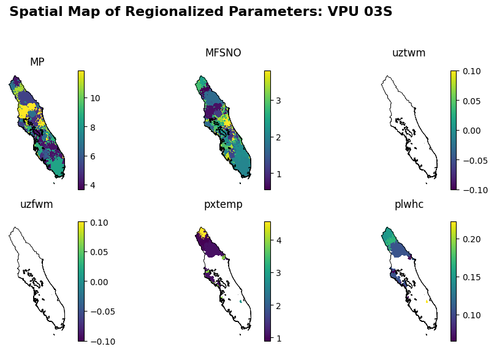

Attribute Spatial Maps
~~~~~~~~~~~~~~~~~~~~~~

Description: These maps display the spatial distribution of attribute values across all catchments in the VPU. 
It helps in understanding the variability of attributes used in parameter regionalization. Only attributes configured
for plotting (in the output section of the configuration) are shown. Plot created using data from :ref:`attr_data_final`.

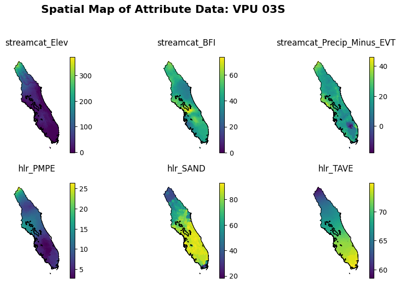

Attribute Histogram
~~~~~~~~~~~~~~~~~~~

Description: These histograms display the distribution of attribute values across all catchments in the VPU. 
It helps in understanding the variability of attributes used in parameter regionalization. Only attributes configured
for plotting (in the output section of the configuration) are shown. Plot created using data from :ref:`attr_data_final`.

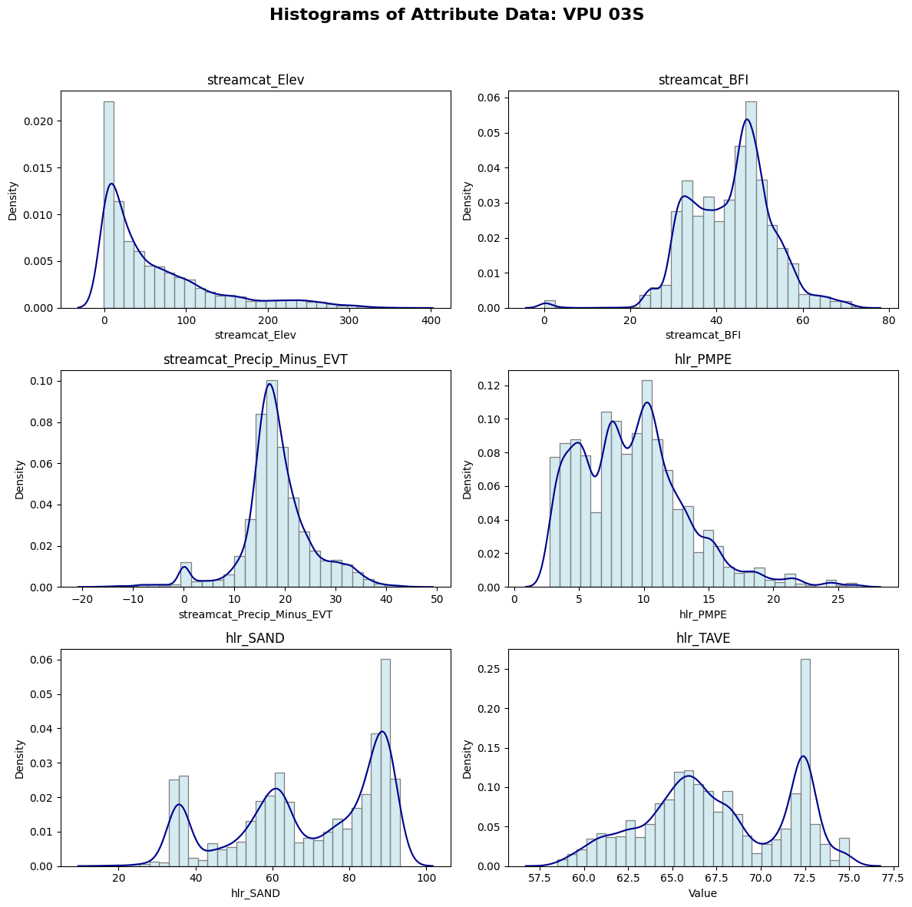

Donor Spatial Map
~~~~~~~~~~~~~~~~~~

Description: This map displays the spatial distribution of available calibration basins in the VPU (and with the buffer 
zone surrounding the VPU). Some calibration basins are not qualified as donors given the metrics screening criteria
specified in the configuration.

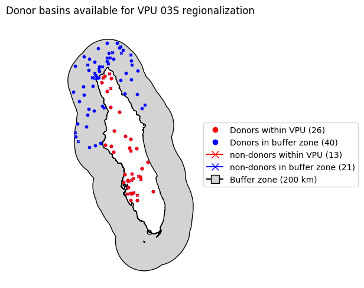

.. _missing_attribute_barchart:

Missing Attribute Barchart
~~~~~~~~~~~~~~~~~~~~~~~~~~

Description: This bar chart visualizes the count of catchments in the VPU with missing attributes. 
It helps in understanding the data gaps that may affect parameter regionalization. Missing attributes are
excluded from the parameter regionalization process for affected catchments. 
Plot created using data from :ref:`attr_data_final`.

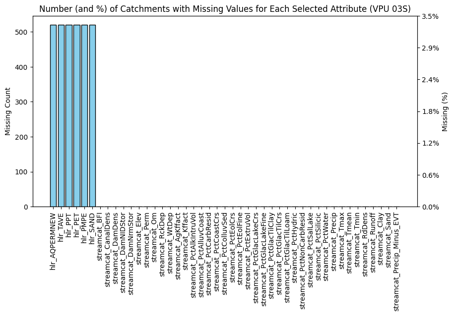
