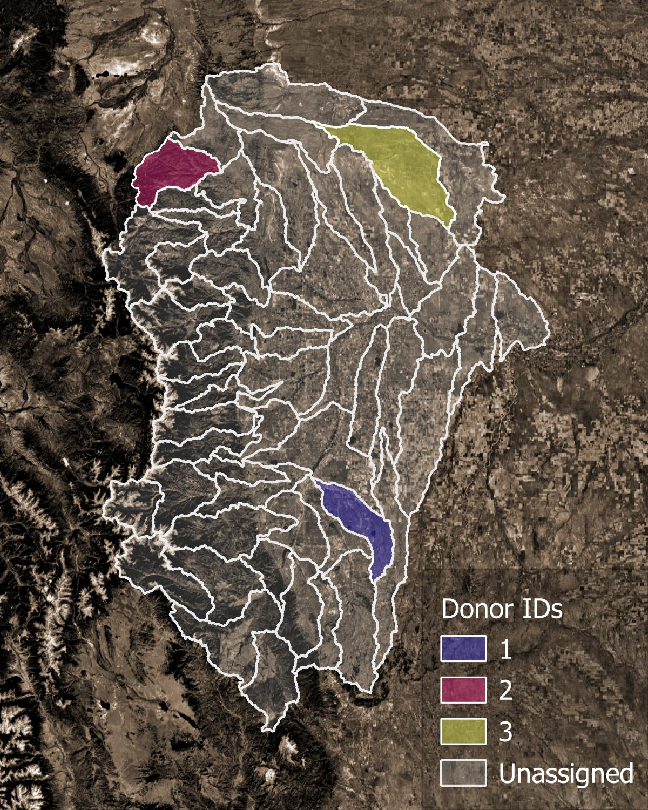
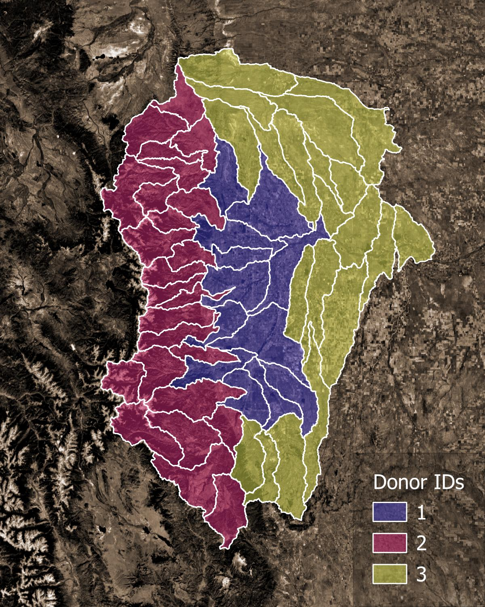

Parameter Regionalization
==========================

Introduction
------------

The parameter regionalization process assigns pairs of divides as donors and receivers. Donor divides are calibrated
divides. Receiver divides are uncalibrated divides that will have parameters assigned to them from their donor. Donor
receiver pairings are assigned based on the proximity of divides in both spatial and physiographic parameter space.
Several methods are provided for pairing, including clustering methods (kmeans, kmedoids, HDBSCAN, URF), distance
methods (Gower, URF), and spatial proximity methods. Typically, spatial proximity is used as a fallback method for
any unpaired receivers after the main pairing (clustering or distance) method is applied.

**Required input:**
   - Divide attribute datasets
   - Selection of specific attributes from each dataset to use for pairing
   - NextGen divides hydrofabric (divides layer)
   - Calibration and validation statistics for all calibration basins within the VPU (and nearby VPUs) for each candidate formulation.
   - Configuration file (config_parreg.yaml) specifying pairing methods, attributes to use, donor screening criteria, and other pairing options.

See the :doc:`Input Data <input_data>` page for details.

Process
--------

   **Figure 1.** Example of donor catchments (colors) and receiver catchments (translucent).

1. Parameter regionalization begins with data validation. The attribute and spatial distance datasets are checked to
   make sure that all donors and receivers in each VPU are present. The percent nan values in the attribute dataset are
   recorded. See example plot at :ref:`missing_attribute_barchart`.

2. All primary attributes, as selected with ``attr_list`` or ``attr_select_file`` for each dataset specified in the
   configuration, are used to calculate catchment similarity when pairing receivers with donors. For distance-based
   methods, if some receivers remain unpaired after the first pass using a full attribute set, a second pass is
   performed using a reduced set of attributes defined by ``base_attr_list`` for each dataset in the config_parreg.yaml.

3. For each formulation:

   * Split receivers into cohorts with the same non-nan attributes. For example, cohort 1 uses ``ngen_mp``, ``ngen_slope_1km``,
     and ``hlr_PET`` but cohort 2 only uses ``ngen_slope_1km`` and ``hlr_PET`` because all of the receivers in cohort 2
     are missing values for ``ngen_mp``.

   * Similarly, receivers are grouped into snowy and non-snowy cohorts. Snowy receivers are paired only with snowy
     donors, and non-snowy receivers only with non-snowy donors. The snowy/non-snowy classification is determined by
     the ``snow_cover`` settings in config_parreg.yaml.

   * For each cohort:

     * Standardize attribute values (0 mean, unit variance), and remove attribute correlations with a Principal Component Analysis (PCA).

     * Apply a distance or clustering algorithm (see method specifics below) to assign a donor to each receiver.

       * **distance methods (gower, urf)**: assign nearest donor in attribute space to each receiver

         * First pass: use all primary attributes.
         * Second pass (if needed): use only ``base attributes``.

       * **clustering methods (kmeans, kmedoids, hdbscan, birch)**: using all primary attributes, assign the spatially nearest donor within the same cluster to each receiver.

     * In addition to the final donor, up to ``n_donor_max`` closest donors are also recorded in the pair results
        for future reference (e.g., for ensemble applications).

4. Any receivers that remain unpaired after the preceding steps are assigned their nearest donor in geographic space
   using the *proximity* method.

   **Figure 1.** Example of final pairings. Each receiver catchment is assigned a donor catchment.

Pairing Methods
----------------

**Distance-based methods**
~~~~~~~~~~~~~~~~~~~~~~~~~~

* **Gower** This method calculates the `Gower's distance <https://en.wikipedia.org/wiki/Gower%27s_distance>`_ between
  each receiver and all potential donors using the PCA-transformed attribute data, with weights for each principal
  component set according to the percentage of variance it explains. Each receiver is assigned the donor with
  the lowest Gower's distance. Donors are identified by iteratively searching in neighborhoods of increasing
  radius until a candidate meeting both attribute , using all primary attributes.and spatial distance criteria is found.

  * *Type*: attribute distance metric
  * *How it works*: Calculates a weighted distance between receivers and donors based on PCA-transformed attributes.
  * *Pros*: Simple to understand and implement; effective for mixed data types.
  * *Cons*: May not capture complex relationships; sensitive to scaling and outliers.

* **URF** This method builds an unsupervised random forest from the raw or PCA-transformed attribute data. It begins by
  constructing a joint distribution of the explanatory variables and drawing samples from this distribution to create
  synthetic data. The real and synthetic data are combined into a single dataset, with a label indicating the source
  of each observation. Next, a `random forest classifier <https://scikit-learn.org/stable/modules/generated/sklearn.ensemble.RandomForestClassifier.html>`_
  is trained to distinguish real observations from synthetic ones. The resulting model produces a
  similarity/dissimilarity matrix, which is used to assign donors to receivers using the same iterative approach
  as the Gower method.

  * *Type*: Ensemble, tree-based
  * *How it works*: Constructs a random forest to create a similarity/dissimilarity matrix based on how often
    pairs of points end up in the same leaf node across all trees.
  * *Pros*: Captures complex relationships; robust to noise.
  * *Cons*: Computationally intensive; results can be harder to interpret.

**Clustering-based methods**
~~~~~~~~~~~~~~~~~~~~~~~~~~~~~

* **KMeans** This pairing method clusters the PCA-transformed attribute data using the
  `kmeans <https://scikit-learn.org/stable/modules/generated/sklearn.cluster.KMeans.html>`_ clustering algorithm. After clustering,
  receivers with one donor in their cluster select that donor. Receivers with no donors in their cluster, select their
  nearest donor (in geographical space). Clusters with more than one donor in them are sub-clustered, and the process is
  repeated until all receivers are paired with donors.

  * *Type*: Centroid-based, partitioning method
  * *How it works*: Partitions the data into k clusters by minimizing the sum of squared distances between points
    and their cluster centroids.
  * *Pros*: Simple, fast, widely used.
  * *Cons*: Sensitive to outliers, assumes roughly spherical clusters, requires specifying the number of clusters
    in advance. In our implementation, the latter is addressed by iteratively sub-clustering into
    2 clusters each time until all receivers are paired.

* **KMedoids** This pairing method clusters the PCA-transformed attribute data using the `kmedoids <https://scikit-learn-extra.readthedocs.io/en/stable/generated/sklearn_extra.cluster.KMedoids.html>`_ clustering algorithm. Once clustering
  is complete, it proceeds with the same approach as kmeans.

  * *Type*: Partitioning, medoid-based
  * *How it works*: Similar to KMeans, but uses actual data points (medoids) as cluster centers instead of means.
    Minimizes the sum of dissimilarities between points and their medoid.
  * *Pros*: More robust to outliers and noise than KMeans.
  * *Cons*: Slower than KMeans, still requires k to be specified (but addressed by iterative sub-clustering).

* **HDBSCAN** This pairing method clusters the PCA-transformed attribute data using the
  `hdbscan - Hierarchical Density-Based Spatial Clustering of Applications with Noise <https://scikit-learn.org/stable/modules/generated/sklearn.cluster.HDBSCAN.html>`_
  clustering algorithm. Once clustering is complete, it proceeds with the same approach as kmeans.

  * *Type*: Density-based, hierarchical
  * *How it works*: Builds a hierarchy of clusters based on varying density thresholds and extracts stable clusters.
    Can detect clusters of varying shapes and sizes.
  * *Pros*: Does not require specifying the number of clusters; handles noise/outliers well; detects clusters of
    arbitrary shapes.
  * *Cons*: Can be more complex to tune and interpret.

* **BIRCH** This pairing method clusters the PCA-transformed attribute data using the
  `BIRCH - Balanced Iterative Reducing and Clustering using Hierarchies <https://scikit-learn.org/stable/modules/generated/sklearn.cluster.Birch.html>`_
  clustering algorithm. Once clustering is complete, it proceeds with the same approach as kmeans.

  * *Type*: Hierarchical, tree-based
  * *How it works*: Incrementally builds a tree summarizing the data and clusters it using hierarchical methods. Can handle large datasets efficiently.
  * *Pros*: Scales well to large datasets, can be combined with other clustering algorithms for refinement.
  * *Cons*: Assumes clusters are roughly spherical; sensitive to the choice of threshold and branching factor.

**Summary of differences**
~~~~~~~~~~~~~~~~~~~~~~~~~~

* **Distance vs Clustering**: Distance methods assign donors based on nearest neighbor in attribute space, while
  clustering methods group catchments in attribute space and assign donors within clusters.

* **Gower vs URF**: Gower uses a weighted distance metric based on PCA components, while URF builds a random forest
  to derive a similarity matrix capturing complex relationships. URF is generally more robust to noise and can be trained
  using raw attributes, while Gower must rely on PCA-transformed data.

* **KMeans vs KMedoids**: KMeans uses centroids (can be outside data), KMedoids uses actual points (more robust).

* **KMeans/KMedoids vs HDBSCAN/BIRCH**: KMeans and KMedoids require specifying k (fixed at 2 here); HDBSCAN and
  BIRCH can handle variable cluster sizes and shapes and are more robust to outliers.

* **HDBSCAN vs BIRCH**: Both hierarchical, but HDBSCAN is density-based and detects irregular clusters, while
  BIRCH is tree-based and designed for large datasets with roughly spherical clusters.

Notes
-----

- Configuration for parameter regionalization is specified in `config_parreg.yaml`.

- The python module `nwm_region_mgr.parreg` contains functions for performing parameter regionalization.

- Currently, three attribute datasets are supported:

  * `NextGen attributes <https://lynker-spatial.s3-us-west-2.amazonaws.com/hydrofabric/v2.2/hfv2.2-data_model.html>`_.
  * `Hydrologic Landscape Regions (HLR) attributes <https://www.usgs.gov/publications/hydrologic-landscape-regions-united-states>`_.
  * `StreamCat attributes <https://www.epa.gov/national-aquatic-resource-surveys/streamcat-dataset>`_.

- Parameter regionalization is carried out separately for each individual VPU, to avoid potential memory issues and
  algorithm inefficiency.

- Parameter regionalization requires formulation regionalization to be completed first. Hence, for each parameter
  regionalization run, the workflow will first check if the required outputs from formulation regionalization for
  the relevant VPUs already exist; if not, the workflow will run formulation regionalization for the relevant VPUs before
  proceeding with parameter regionalization.

- Parameter regionalization for a given VPU may also rely on formulation-regionalization outputs from neighboring VPUs,
  depending on whether calibration basins from those VPUs fall within the buffer distance specified in the configuration.

- The algorithm generated donor-receiver pairs can be updated to incorporate specific manual pairs, if provided via
  `manual_pairings_file` in config_general.yaml(see the corresponding section in :doc:`Input Data <input_data>` page for details).

.. toctree::
   :maxdepth: 2

